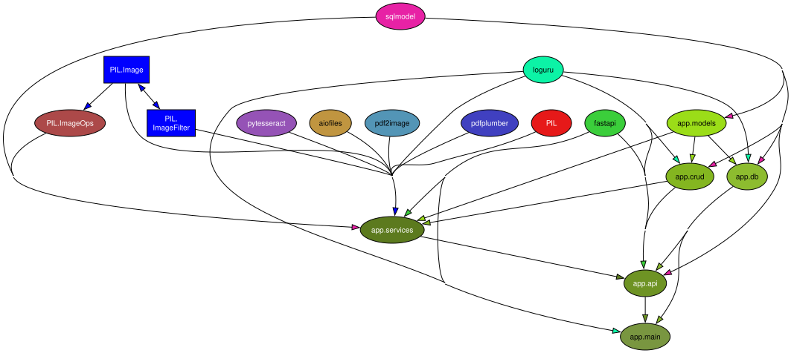
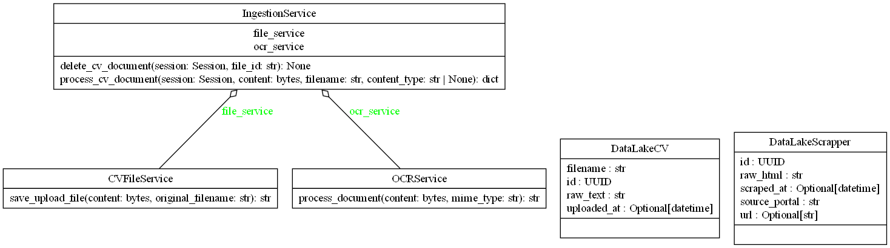

# Struktura i Powiązania Projektu

## Wykres Zależności Pakietów

Wykres wygenerowany automatycznie za pomocą `pydeps`:

## Diagram Klas UML

Architektura obiektowa systemu wygenerowana przez `pyreverse`:

