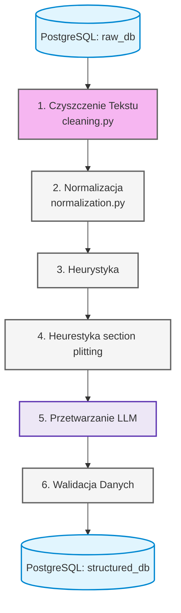

# Moduł ETL i Transformacji Danych

Ten moduł odpowiada za proces **Extract, Transform, Load**, czyli wyczyszczenie surowego tekstu pozyskanego z plików PDF/skanów, przygotowanie go pod walidację przez modele LLM oraz przekazanie do ustrukturyzowanej bazy danych PostgreSQL

---

## Data flow

---

## Główne Komponenty

### 0. Orkiestrator (`pipeline.py`)

Klasa `CvEtlPipeline` działa jako główny **orkiestrator całego procesu**. Jej zadaniem jest zapewnienie sekwencyjnego przepływu danych.

- **Zarządzanie stanem:** Pobiera surowy tekst z tabeli `data_lake_cv` na podstawie przekazanego `file_id`.
- **Wykonanie etapów:** Przekazuje tekst najpierw do modułu czyszczącego (`clean_ocr_text`), a następnie do normalizatora (`CVTextNormalizer`).
- **Zapis (Load):** Po przejściu wszystkich transformacji, orkiestrator automatycznie zapisuje gotowy, oczyszczony produkt do nowej warstwy bazy danych (`processed_cv`), udostępniając go kolejnym modułom systemu.

---

### 1. Czyszczenie Tekstu (`cleaning.py`)

Moduł ten odpowiada za wstępne przygotowanie surowego tekstu (raw text) pochodzącego z procesu OCR (skany, pliki PDF) przekazanego do RAW Data DB. Jego głównym celem jest usunięcie artefaktów technicznych, naprawa błędów kodowania oraz ujednolicenie struktury znaków białych, co bezpośrednio wpływa na mniejsze zużycie tokenów i lepszą skuteczność modeli LLM.

Główna funkcja entrypoint to `clean_ocr_text(raw_text: str) -> str`.

Kroki transformacji danych:

1. **Naprawa Mojibake i błędów OCR (`_repair_ocr_mojibake`):**
   - Wykorzystuje bibliotekę `ftfy` (Fix Text For You) do automatycznego naprawiania uszkodzonego kodowania znaków.
   - Stosuje zaawansowane wyrażenia regularne (`regex`) do wykrywania specyficznych błędów translacji OCR (np. błędne wstrzykiwanie "krzaczków" wewnątrz lub na początku słów) i zastępuje je polską literą `ż` na podstawie kontekstu sąsiadujących liter.

2. **Normalizacja Unicode (`_normalize_unicode` lub `unicodedata.normalize`):**
   - Sprowadza tekst do formy **NFC (Normalization Form Canonical Composition)**. Składa rozbite znaki diakrytyczne (np. `o` + `◌́`) w jeden konkretny znak (np. `ó`), zapobiegając problemom z interpretacją tekstu przez tokenizatory LLM.

3. **Usuwanie szumu graficznego (`_remove_graphic_noise`):**
   - **Wykrywanie artefaktów:** Usuwa sekwencje powtarzających się znaków niealfanumerycznych (np. linii składających się z `---`, `___`, `***`), które często są pozostałościami po tabelach lub separatorach w PDF.
   - **Czyszczenie tagów fontów:** Pozbywa się błędów mapowania czcionek, takich jak specyficzne dla formatu PDF sekwencje `(cid:\d+)`.
   - **Usuwanie punktorów:** Odsiewa zbędne symbole graficzne i ozdobniki (np. `■`, `♦`, `•`).

4. **Normalizacja znaków białych (`_normalize_whitespace`):**
   - Redukuje wielokrotne spacje i tabulacje do pojedynczej spacji (` `).
   - Usuwa spacje z początku i końca każdej linii (trimowanie wieloliniowe).
   - Zastępuje agresywne, wielokrotne entery (3 lub więcej) maksymalnie dwoma znakami nowej linii (`\n\n`), co pozwala zachować logiczny podział na akapity bez sztucznego rozciągania tekstu.

---

### 2. Normalizacja (`normalization.py`)

Klasa `CVTextNormalizer` odpowiada za ujednolicenie formatów kluczowych danych tekstowych (daty, numery telefonów, linki, poziomy językowe). Standaryzacja zapisu ułatwia modelowi LLM precyzyjne mapowanie przedziałów czasowych oraz danych kontaktowych kandydata.

#### Główna funkcja wejściowa: `normalize_text(self, text: str) -> str`

- **Działanie:** Stanowi punkt wejściowy (entrypoint) procesu normalizacji. Instancjonuje potok sekwencyjny – najpierw sprawdza, czy tekst nie jest pusty (zwraca wtedy pusty ciąg), rejestruje uruchomienie logiem debugującym za pomocą biblioteki `loguru`, a następnie przekazuje tekst kolejno przez cztery wyspecjalizowane metody transformacji.

#### Szczegółowy opis mechanizmów transformacji:

##### A. Standaryzacja dat i okresów zatrudnienia (`_normalize_dates`)

Metoda ta realizuje trzy niezależne reguły transformacji tekstu, przetwarzając go krok po kroku w celu ujednolicenia zapisów chronologicznych w CV:

- **Krok 1: Konwersja formatów w pełni numerycznych**
  - **Wzorzec Regex:** `\b(0[1-9]|1[0-2])[\./](20\d{2}|19\d{2})\b`
  - **Działanie:** Wykrywa dwucyfrowy miesiąc (od `01` do `12`) oddzielony znakiem `.` lub `/` od czterocyfrowego roku (zakres `1900-2099`).
  - **Transformacja:** Zamienia kolejność segmentów na standard ISO `YYYY-MM` (np. `05.2020` oraz `05/2020` zostają przekształcone w `2020-05`).

- **Krok 2: Mapowanie nazw miesięcy (Polski / Angielski)**
  - **Wzorzec Regex:** `\b{month_name}\s+(20\d{2}|19\d{2})\b` (kompilowany dynamicznie z flagą `IGNORECASE`).
  - **Działanie:** Iteruje po wewnętrznym słowniku `_months_map` zawierającym odmiany, mianowniki oraz skróty miesięcy w obu językach (np. _stycznia_, _sty_, _january_, _jan_).
  - **Transformacja:** Podmienia dopasowaną nazwę miesiąca i rok na format `YYYY-MM` pobierając przypisany kod numeryczny (np. tekst _„od marca 2018 do lipiec 2022”_ zostanie zredukowany do _„od 2018-03 do 2022-07”_).

- **Krok 3: Unifikacja określeń teraźniejszości**
  - **Wzorzec Regex:** `\b(obecnie|teraz|aktualnie|present|w tej chwili|do dziś)\b` (z flagą `IGNORECASE`).
  - **Działanie:** Skanuje tekst w poszukiwaniu potocznych oraz biznesowych określeń otwartego przedziału czasowego.
  - **Transformacja:** Nadpisuje każde dopasowane słowo sztywnym, wielkoformatowym tokenem `PRESENT` (np. zapis _„2022-09 - obecnie”_ przyjmuje ujednoliconą postać _„2022-09 - PRESENT”_).

##### B. Normalizacja numerów telefonów (`_normalize_phone_numbers`)

- **Wzorzec Regex:** `(?:\+\d{1,3}[ \t\-]*)?\(?\d{3}\)?[ \t\-]*\d{3}[ \t\-]*\d{3,4}\b`
- **Działanie:** Identyfikuje numery telefonów w tekście, uwzględniając opcjonalne numery kierunkowe kraju (np. `+48`, `+44`) oraz różne separatory (spacje, tabulacje, myślniki, nawiasy).
- **Transformacja:** Wywołuje wewnętrzną funkcję pomocniczą `clean_phone`, która za pomocą `regex.sub` usuwa z dopasowanego ciągu wszystkie znaki białe, myślniki oraz nawiasy, pozostawiając jednolity, ciągły numer (np. `+48 123-456-789` -> `+48123456789`).

##### C. Czyszczenie hiperłączy (`_normalize_hyperlinks`)

- **Wzorzec Regex 1:** `https?://(www\.)?(github\.com|linkedin\.com|linkedin\.pl|linkedin\.com/in)/?` (z flagą `IGNORECASE`).
- **Wzorzec Regex 2 (post-processing):** `(?<!:)/{2,}`
- **Działanie:** Wykrywa adresy URL prowadzące do profili zawodowych kandydata (LinkedIn, GitHub), usuwając zbędne protokoły (`http://`, `https://`) oraz przedrostki `www.`.
- **Transformacja:** 1. Upraszcza odnośnik do formy bezpośredniej domeny (np. `https://www.linkedin.com/in/user/` -> `linkedin.com/in/user/`). 2. Zabezpiecza tekst przed powielonymi ukośnikami (zamienia wielokrotne `//` na pojedyncze `/`), ignorując te występujące bezpośrednio po dwukropku (zapobiega to uszkodzeniu ewentualnych innych linków).

##### D. Ujednolicanie poziomów językowych (`_normalize_language_levels`)

- **Wzorzec Regex:** `\b([a-cC-C])[-\s]*([1-2])\b`
- **Działanie:** Wykrywa oznaczenia poziomów znajomości języków obcych zgodne ze standardem europejskim CEFR (od A1 do C2), radząc sobie z chaotycznymi separatorami (spacje, myślniki) oraz różną wielkością liter.
- **Transformacja:** Wykorzystuje funkcję lambda do przechwycenia grup dopasowania, usuwa zbędne znaki pomiędzy literą a cyfrą oraz wymusza wielką literę formatu za pomocą `.upper()` (np. zapisy `b2`, `c-1` czy `A 2` zostają sprowadzone odpowiednio do postaci `B2`, `C1`, `A2`).

---

### 3. Heurestyka

### 4. Heurestyka Section Splitting

### 5. LLM

### 6. Walidacja
